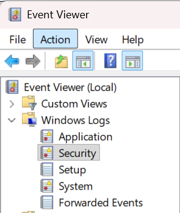

# Authentication and Logon Analysis

## Why Authentication Logs Matter

Authentication events are among **the most important logs** during SOC monitoring and DFIR investigations. Attackers almost always interact with authentication mechanisms at some stage of the attack, whether through brute-force attempts, stolen credentials, lateral movement, remote access, or privilege escalation.

By analyzing logon events, investigators can identify:

- Unauthorized access attempts
- Suspicious remote logins
- Brute-force activity
- Lateral movement between systems
- Abuse of privileged accounts

Authentication analysis is often the starting point for reconstructing the attacker’s initial access and movement inside the environment.

---

## Main Authentication Event IDs

Most authentication-related events are found inside **Windows Logs → Security**

  

The following Event IDs are commonly analyzed during investigations:

| Event ID | Description                              |
| -------- | ---------------------------------------- |
| 4624     | Successful logon                         |
| 4625     | Failed logon                             |
| 4634     | Logoff                                   |
| 4647     | User initiated logoff                    |
| 4648     | Logon using explicit credentials         |
| 4672     | Special privileges assigned to new logon |
| 4768     | Kerberos authentication ticket requested |
| 4769     | Kerberos service ticket requested        |
| 4771     | Kerberos pre-authentication failed       |
| 4776     | NTLM authentication attempt              |

