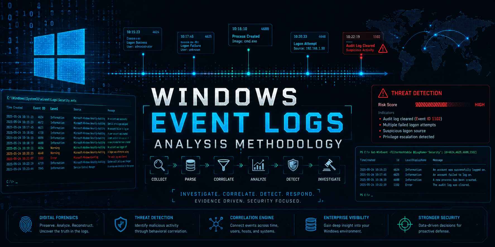

# Windows Event Logs Analysis Methodology

## Overview 

A structured DFIR guide focused on identifying, collecting, and analyzing Windows forensic artifacts to support incident response, threat hunting, and malware investigations.

---

## Core Modules

1. [Windows Event Logging Fundamentals](01-windows-event-logging-fundamentals.md)
2. [Authentication & Logon Analysis](02-authentication-and-logon-analysis.md)
3. [Process Execution & Malware Tracking](03-process-execution-and-malware-tracking.md)
4. [Persistence Through Event Logs](04-persistence-through-event-logs.md)
5. [Lateral Movement & Network Behavior](05-lateral-movement-and-network-log-analysis.md)
6. [Privilege Escalation & Evasion](06-privilege-escalation-and-defense-evasion.md)
7. [PowerShell & Script Block Analysis](07-powershell-and-script-block-analysis.md)
8. [C2 Communication Detection (Event Logs View)](08-c2-and-suspicious-network-behavior.md)
9. [Timeline Correlation (CORE DFIR SKILL)](09-timeline-correlation-with-event-logs.md)
10. [Incident Case Study (MAKE THIS POWERFUL)](10-incident-case-study.md)
